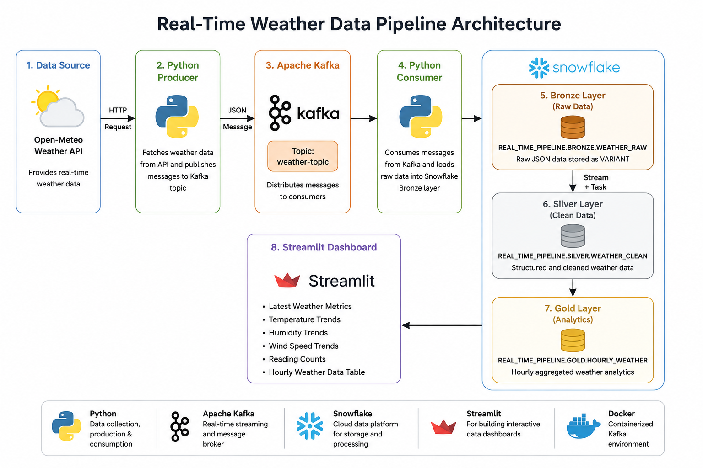
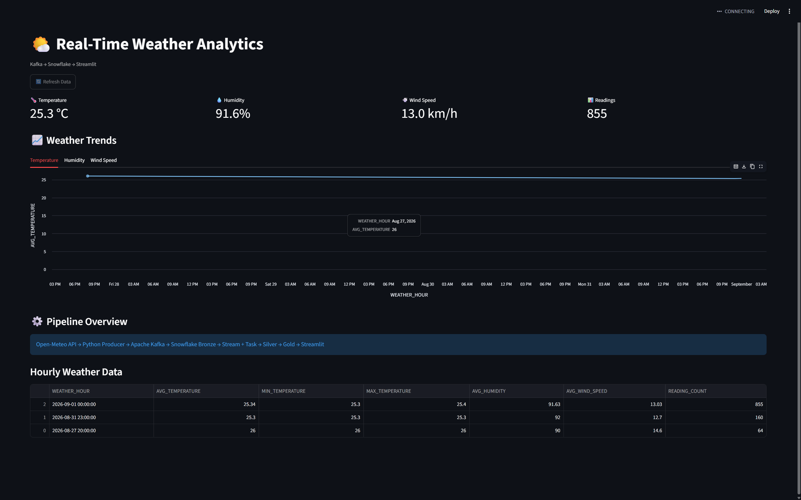

## Live Demo

[View the Live Weather Dashboard]https://real-time-kafka-app-pipeline-jkxdbbzsenpktp6h6ssgsu.streamlit.app/
# Real-Time Weather Data Pipeline

A real-time data engineering project that collects weather data, streams it through Apache Kafka, processes it using Snowflake's Medallion Architecture, and visualizes analytics through a Streamlit dashboard.

## Architecture Diagram



## Dashboard Preview



## Architecture

```text
Open-Meteo Weather API
        |
        v
Python Kafka Producer
        |
        v
Apache Kafka
(weather-topic)
        |
        v
Python Kafka Consumer
        |
        v
Snowflake BRONZE
Raw JSON / VARIANT
        |
        v
Snowflake Stream + Task
        |
        v
Snowflake SILVER
Clean Structured Data
        |
        v
Snowflake GOLD
Hourly Weather Analytics
        |
        v
Streamlit Dashboard
```

## Technologies

- Python
- Apache Kafka
- Docker
- Snowflake
- Snowflake Streams & Tasks
- SQL
- Streamlit
- Pandas
- Open-Meteo API
- Git & GitHub

## Data Pipeline

### 1. Data Collection

The Python producer retrieves current weather information from the Open-Meteo API.

The data includes:

- Temperature
- Humidity
- Wind speed
- Latitude
- Longitude
- Timestamp

### 2. Kafka Streaming

Weather records are serialized as JSON and published to the Kafka topic:

```text
weather-topic
```

Kafka runs locally using Docker in KRaft mode.

### 3. Bronze Layer

A Python Kafka consumer reads messages from Kafka and loads the raw JSON records into:

```text
REAL_TIME_PIPELINE.BRONZE.WEATHER_RAW
```

The raw weather payload is stored using Snowflake's `VARIANT` data type.

### 4. Silver Layer

The Silver layer transforms raw JSON into structured columns including temperature, humidity, wind speed, coordinates, and timestamps.

Snowflake Streams track newly inserted Bronze records.

Snowflake Tasks automatically process new records into:

```text
REAL_TIME_PIPELINE.SILVER.WEATHER_CLEAN
```

### 5. Gold Layer

The Gold layer provides analytics-ready hourly weather statistics including:

- Average temperature
- Minimum temperature
- Maximum temperature
- Average humidity
- Average wind speed
- Number of readings

The analytics view is:

```text
REAL_TIME_PIPELINE.GOLD.HOURLY_WEATHER
```

### 6. Dashboard

The Streamlit dashboard connects to the Snowflake Gold layer and displays:

- Latest weather metrics
- Temperature trends
- Humidity trends
- Wind-speed trends
- Reading counts
- Hourly weather data

## Project Structure

```text
real-time-kafka-snowflake-pipeline/
|
|-- producer/
|   |-- weather_producer.py
|   |-- weather_consumer.py
|   `-- snowflake_loader.py
|
|-- docker/
|   `-- compose.yml
|
|-- snowflake/
|   |-- 01_setup.sql
|   |-- 02_silver_layer.sql
|   `-- 03_gold_layer.sql
|
|-- dashboard/
|   `-- app.py
|
|-- docs/
|
|-- requirements.txt
|-- .gitignore
`-- README.md
```

## Running the Project

### Start Kafka

```bash
docker compose -f docker/compose.yml up -d
```

### Start the Weather Producer

```bash
python producer/weather_producer.py
```

### Start the Kafka Consumer

```bash
python producer/weather_consumer.py
```

### Start the Dashboard

```bash
python -m streamlit run dashboard/app.py
```

## Environment Variables

Create a `.env` file in the project root:

```env
SNOWFLAKE_ACCOUNT=your_account
SNOWFLAKE_USER=your_username
SNOWFLAKE_PASSWORD=your_password
SNOWFLAKE_WAREHOUSE=PIPELINE_WH
SNOWFLAKE_DATABASE=REAL_TIME_PIPELINE
SNOWFLAKE_SCHEMA=BRONZE
```

The `.env` file is excluded from Git and should never be committed.

## Key Concepts Demonstrated

This project demonstrates:

- Real-time event streaming with Apache Kafka
- Containerized Kafka infrastructure
- Python-based data ingestion
- JSON processing
- Snowflake VARIANT storage
- Medallion Architecture
- Bronze, Silver, and Gold data layers
- Incremental processing using Snowflake Streams
- Automated transformations using Snowflake Tasks
- Analytics-ready SQL modeling
- Streamlit data visualization
- Environment-variable based credential management